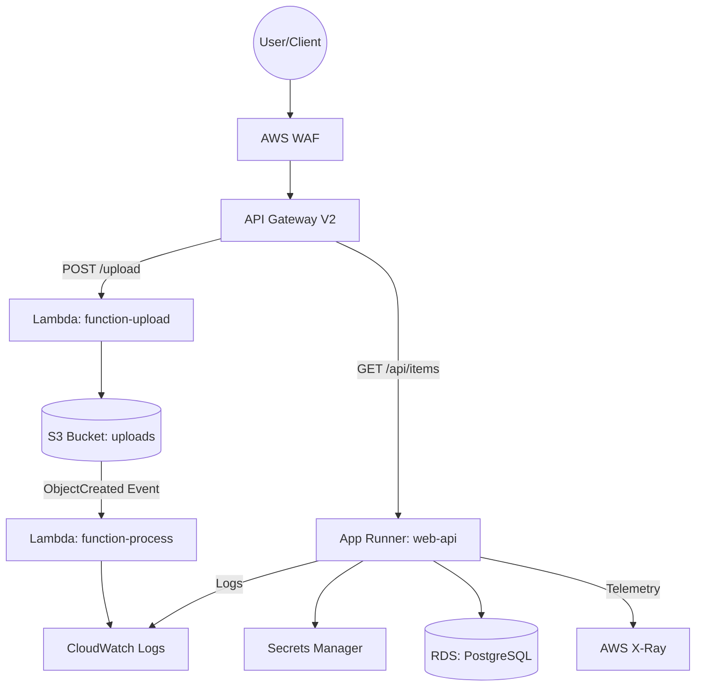

# Architecture Diagram

The diagram below illustrates the flow of requests and data within the Enterprise Serverless Platform on AWS.

## Component Overview

- **AWS WAF**: Provides security against web attacks (SQLi, XSS) and DDoS.
- **API Gateway**: A serverless entry point that routes traffic to Lambda and App Runner.
- **AWS Lambda**: Handles event-driven tasks efficiently and scales to zero.
- **Amazon App Runner**: Simplifies container deployment, managing infrastructure and scaling automatically.
- **Amazon RDS**: Managed relational database for persistent state.
- **AWS Secrets Manager**: Protects sensitive credentials like DB passwords.
- **AWS X-Ray**: Enables distributed tracing to debug performance across services.
